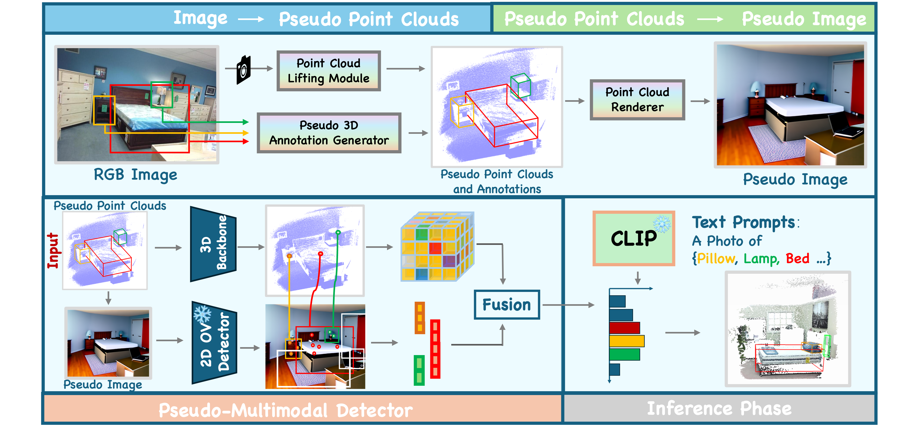

# ImOV3D: Learning Open Vocabulary Point Clouds 3D Object Detection from Only 2D Images (NeurIPS2024)

### This project will be open-sourced within two weeks after the CVPR 2025 submission, between November 15 and December 1.

## Framework
 
  

 
