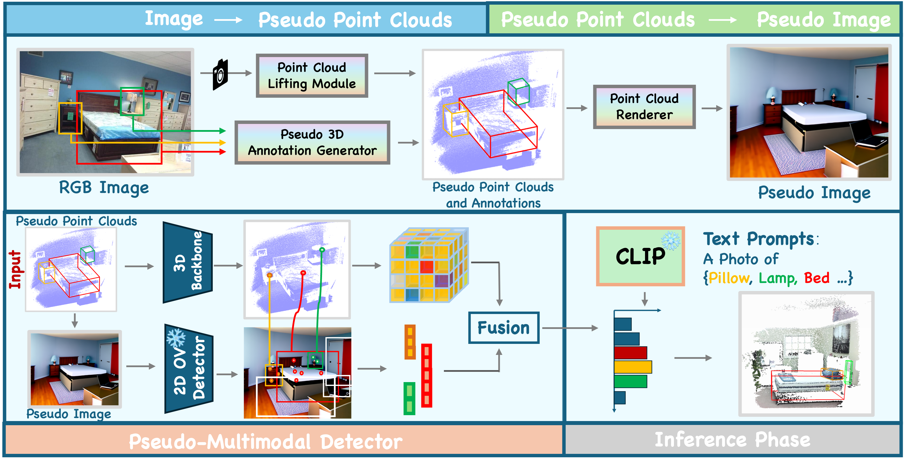
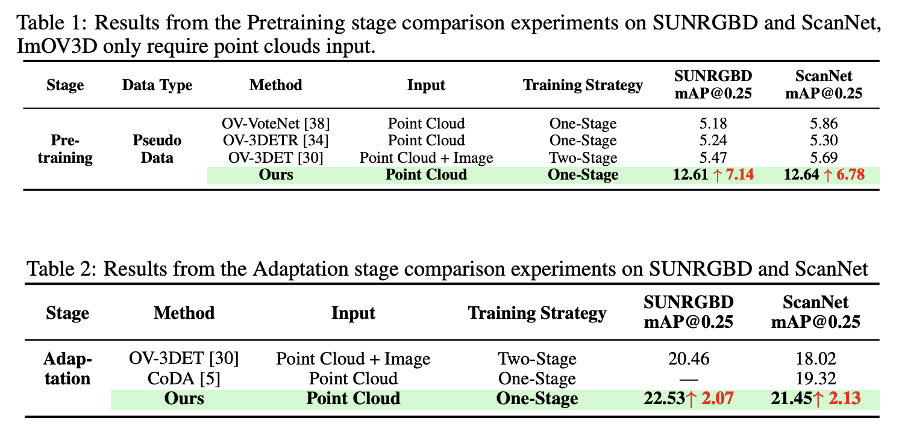
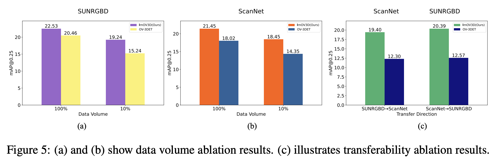
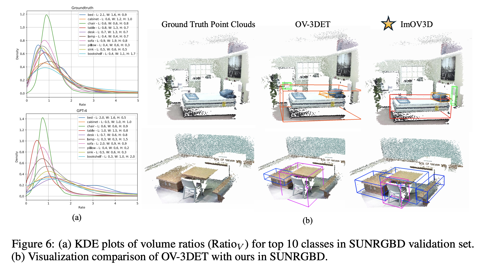

<h2 align="center">
  <b>ImOV3D: Learning Open Vocabulary Point Clouds 3D Object Detection from Only 2D Images</b>

  <b><i> NeurIPS 2024 🇨🇦 </i></b>
</h2>

<!--  -->

> [Timing Yang*](https://yangtiming.github.io/), [Yuanliang Ju*](https://x.com/averyjuuu0213), [Li Yi](https://ericyi.github.io/)  
> Shanghai Qi Zhi Institute, IIIS Tsinghua University, Shanghai AI Lab 

🕹️**To Do List**  

&#9744; The code and data will be released within one month. Please stay tuned.

&#9745; Our paper ImOV3D is released, check out it on [arXiv](https://arxiv.org/pdf/2410.24001v1).

## Overall Pipeline
 
  

## Main Results
 
  

## More Ablation Study and Visualization

  

  

